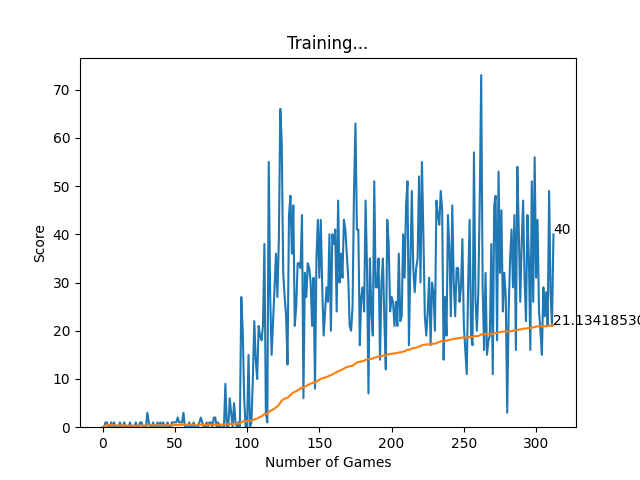

# Snake-ML-Evolution History

## Why this exists?

I recently finished my first machine learning project training a Multi-Layer Perceptron (MLP) to recognize handwritten digits (MNIST). It was fascinating, but I came upon the idea of training something more interactive and dynamic: **Can a simple neural network learn to survive?**

This repository documents my journey of building a Reinforcement Learning agent for the classic Snake game from scratch.

---

## The Environment (`game.py`)

To train an AI, a standard game loop for human players won't work. I needed to decouple the game logic from the rendering speed.

I rebuilt the Snake game using `pygame`, with a specific **"AI Interface"**:

1.  **`play_step(action)`**: Instead of listening to keyboard events, the game waits for the agent to pass an `action` (e.g., `[1, 0, 0]` for "Go Straight").
2.  **Instant Feedback**: The function immediately returns:
    * `reward`: Did we do something good?
    * `done`: Did we die?
    * `score`: Current game score.
3.  **Visuals**: I kept the UI rendering enabled. This allows us to visually inspect the "personality" of the model as it trains—watching it go from suicidal to strategic is the best part.
4.  **Reward Function**: I grant **+10** when the snake successfully eats the food. A **-10** penalty is applied when the snake either dies or spins infinitely in circles to survive (fails to eat food within a certain period).

*`helper.py` serves as our data analyst, plotting the score history in real-time so we can visualize the convergence.*

---

## The Brain (`agent.py` & `model.py`)

This is the core of the project. I used an MLP to implement the **Deep Q-Learning (DQN)** algorithm to train my AI. 

### 1. Feature Engineering: The 11 Parameters

I compressed the entire game state into a vector of just **11 integers**. My goal was to give the AI a **"Relative Perspective"** (First-person view) rather than an absolute map.

Every frame, the agent asks 11 simple Yes/No questions (0 or 1):

**A. Danger Perception (Relative to Head)**
* Is there danger **Straight Ahead**?
* Is there danger to my **Right**?
* Is there danger to my **Left**?
* *Note: These directions are relative to the direction of the snake. By using relative directions, the AI learns "Don't hit the wall on your right" regardless of whether it's facing North, South, East, or West, which allows the AI to learn faster.*

**B. Current Orientation**
* Am I moving **Left**?
* Am I moving **Right**?
* Am I moving **Up**?
* Am I moving **Down**?

**C. Target Location (The Food)**
* Is the food to my **Left**?
* Is the food to my **Right**?
* Is the food **Above** me?
* Is the food **Below** me?

### 2. The Model Architecture

Because the input is simplified to just 11 numbers, a lightweight MLP is sufficient to effectively approximate the Q-function without overfitting. As common practice, I applied **ReLU** to introduce non-linearity, preventing the network from degrading into a single linear regressor. 

* **Input Layer:** 11 Neurons
* **Hidden Layer:** 256 Neurons (ReLU activation)
* **Output Layer:** 3 Neurons (Action: `[Straight, Right, Left]`)

### 3. The Reward Mechanism

The key question is: How does the snake know it's doing well?
I designed the following mechanism: 
* **+10**: Eat Food (Positive Reinforcement).
* **-10**: Game Over (Hit wall or self).
* **0**: Move without eating (To prevent noise, but strict enough to force it to find food).

Under this mechanism, feedback is sparse—given only when the snake eats or dies. Consequently, the agent spends a significant amount of time continuously exploring randomly before stumbling upon food and establishing a positive feedback loop.

---

## Results

This 11-parameter MLP model demonstrated a clear learning curve and is able to survive strategically. 

**Breakdown:**
* **The Exploration Phase (Games 0-90):**
    The agent spent the first ~90 games in a "warm-up" period. Scores hovered near zero as the snake wandered randomly, building up its experience memory (Replay Buffer) without yet understanding the connection between actions and rewards.

* **The Breakthrough (Game 100+):**
    A sharp inflection point occurs around Game 100. The model began to converge, showing a rapid and consistent increase in performance as it learned to associate the "food relative position" with the reward signal.

* **Final Stabilization:**
    By the end of 300 games, the **Mean Score** (orange line) reaches approximately **22**. This indicates the agent consistently finds food and survives. 

### Limitations:
* **High Variance (Score Instability):**
    While the mean score increases steadily, the standard deviation remains high. 

* **The "Dead End" Problem (U-Shape Traps):**
    The agent rarely dies from crashing into walls. Instead, most deaths occur due to **self-trapping**.
    * **Possible Reason:** The 11-parameter input vector only detects *immediate* danger (1 block away). The agent lacks the ability to see the global vision or larger neighboring areas, so it often enters U-shaped body formations (cul-de-sacs) to chase food, only to realize too late that it has trapped itself with no way out.

### Next Steps:
* **Expand State Perception (Spatial Awareness):**
    Currently, the agent acts on immediate local information. The next goal is to augment the input vector to provide more context about the **surrounding grid configurations**. By giving the AI a broader field of view (or specific features detecting enclosed spaces), we aim to help it recognize and avoid complex traps like the U-shape dead ends.

### Modifications:

Now I have added a **9x9 grid** around the snake's head into the parameters. This allows the snake to generally act aware of its surroundings.

Since the original 11 parameters are in directions relative to the snake's orientation, I ensured that the **9x9 grid** is also **relative to the snake's orientation** (rotated based on head direction).

* The reward function remains the same as before.

## Results

This 11 + 81 parameter MLP model did not produce a viable agent after initial training. 

**Analysis:**

* **Flatline:** As clearly shown in the graph, the score remains stuck at **0** for almost the entire duration (approx. 80 games). There are only two isolated spikes where the snake likely consumed one unit of food by pure chance, which was not replicable. 
* **Stagnation:** The mean score flatlined at **~0.02**, indicating that no learning trend was established and the model got stuck in random movement. 

**Possible Causes**

* **Increased Dimensions:** The increase from 11 to 92 parameters significantly added complexity. The model struggled to filter out the noise from the 81 grid inputs to find the relevant signal in the allocated time. 
* **Inadequate Exploration:** I reused the **same reward mechanism and epsilon decay rate** as the simpler 11-parameter model. In this much larger search space, the agent stopped exploring (Epsilon dropped too low) **before** it could discover a successful strategy. 
* **Result:** The model converged prematurely, resulting in an unintelligent agent that moves randomly until it starves or dies. 

### Next Steps (Fixing the Failure)

To help the model navigate the larger state space (92 parameters) and break the learning deadlock, I implemented two critical adjustments:

1.  **Slower Epsilon Decay (Extended Exploration):**
    * Since the input space is much larger, the agent needs more time to "map out" the environment before settling on a strategy. I will adjust the decay rate so that `epsilon` drops much slower, forcing the model to attempt random new strategies for a longer period.

2.  **Reward Shaping (Distance-Based Feedback):**
    * To guide the agent through the sparse environment, I modified the reward function to provide immediate feedback based on **Manhattan Distance**:
        * **+1 Reward:** If the move brings the snake **closer** to the food.
        * **-1 Penalty:** If the move takes the snake **further away** from the food.
    * This changes the problem from "Sparse Rewards" to "Dense Rewards," acting like a compass to point the agent in the right direction.

### Results: The 92-Parameter Success (with Reward Shaping)

After adding distance-based rewarding function and **Slower Epsilon Decay**, the 92-parameter model was able to learn a viable survival strategy.

**Analysis:**
* **Slower Convergence:** As shown in the graph, the learning curve is less steep compared to the 11-parameter baseline, and the model struggled to score in the first ~200 games.
* **Late-Game Surge:** However, starting from Game 200, the model shows a strong upward trend, eventually achieving higher individual scores than the baseline.
* **Interpretation:** This result matches my prediction: as the model has more parameters, the **sample complexity** also increases. The agent simply needs more episodes to "map out" the relationships between the 81 grid pixels and the correct actions.

### Limitations

It is worth noting that despite having 9x9 local vision, the new model's overall performance is **not significantly better** than the simple 11-parameter version.

**Possible Reasons**

1.  **Model Structure Mismatch:**
    I am feeding a 9x9 2D grid into a **Dense (Fully Connected) Layer**, which flattens out the grid into a 1D vector. This destroys the **spatial correlation** of the 2D grids. An MLP struggles to understand geometry compared to a CNN. 

2.  **Sparsity of the Input:**
    In a 9x9 grid of 81 inputs, usually only 1 or 2 cells are active at any given time (representing either body or wall). This creates a highly **sparse input vector**, which can make gradient descent inefficient and slower to converge compared to the dense, high-value boolean features of the 11-parameter model.

### Next Steps: Transitioning to CNN

Since the MLP is not able to effectively preserve **spatial locality** when flattening the grid, my next goal is to upgrade the model to a **Convolutional Neural Network (CNN)**.

* **Objective:** I will rewrite the model to process the $9 \times 9$ grid as a 2D image (3 channels) rather than a flat vector.
* **Hypothesis:** By using convolutional filters, the agent should be able to recognize complex spatial patterns, like "U-shape traps" or "dead ends", much more effectively than the dense network, potentially scoring significantly higher on average.